# 股票分析系统部署文档

## 📚 文档导航

| 文档 | 说明 | 适用场景 |
|------|------|---------|
| **[QUICK-START.md](QUICK-START.md)** | 快速开始指南 | ⭐ 日常使用推荐 |
| [docs/DEPLOYMENT.md](docs/DEPLOYMENT.md) | 完整部署文档 | 首次部署、深入了解 |
| [docs/UPDATE-GUIDE.md](docs/UPDATE-GUIDE.md) | 更新指南 | 代码更新流程 |
| [docs/DEPLOYMENT-SUMMARY.md](docs/DEPLOYMENT-SUMMARY.md) | 部署总结 | 了解部署历史和问题 |

## 🚀 快速更新（最常用）

```bash
# 在本地项目根目录执行
cd deploy/scripts

# 完整更新（前端+后端）
./update-production.sh

# 仅更新后端
./update-backend.sh

# 仅更新前端
./update-frontend.sh
```

## 📦 可用脚本

### 首次部署
```
deploy/scripts/
├── 00-deploy-all.sh           # 一键完整部署
├── 01-init-database.sh        # 初始化数据库
├── 02-deploy-backend.sh       # 部署后端
├── 03-deploy-frontend.sh      # 部署前端
├── create-package.sh          # 创建部署包
├── verify-deployment.sh       # 验证部署
└── backup-database.sh         # 备份数据库
```

### 代码更新
```
deploy/scripts/
├── update-production.sh       # ⭐ 完整更新（推荐）
├── update-backend.sh          # 仅更新后端
└── update-frontend.sh         # 仅更新前端
```

## 🌐 生产环境信息

| 项目 | 信息 |
|------|------|
| **访问地址** | https://qwquant.com |
| **API文档** | https://qwquant.com/api/docs |
| **服务器** | 82.157.28.35 |
| **系统** | Ubuntu 20.04 LTS |
| **Python** | 3.8.10 |
| **Node.js** | v20.19.5 |
| **数据库** | PostgreSQL 12.22 |
| **Web服务器** | Nginx 1.18.0 |

## 📁 服务器目录结构

```
/var/www/stock-analysis/
├── backend/
│   ├── app/                 # FastAPI应用代码
│   ├── venv/                # Python虚拟环境
│   ├── .env                 # 环境配置
│   └── backups/             # 数据库备份
└── frontend/
    ├── dist/                # 构建后的静态文件
    └── src/                 # 源代码
```

## 🔧 常用命令

### 查看服务状态
```bash
ssh ubuntu@82.157.28.35

# 后端服务
sudo systemctl status stock-analysis-backend

# 前端服务（Nginx）
sudo systemctl status nginx
```

### 查看日志
```bash
# 后端日志（实时）
sudo journalctl -u stock-analysis-backend -f

# Nginx错误日志
sudo tail -f /var/log/nginx/qwquant_error.log
```

### 重启服务
```bash
# 重启后端
sudo systemctl restart stock-analysis-backend

# 重启Nginx
sudo systemctl reload nginx
```

## 📊 部署架构

```
Internet (HTTPS)
    ↓
Nginx (:80, :443)
    ├── /          → Frontend (Vue.js SPA)
    └── /api/      → Backend (FastAPI)
                        ↓
                    PostgreSQL (:5432)
```

## ⚡ 更新流程（3分钟）

```mermaid
graph LR
    A[修改代码] --> B[本地测试]
    B --> C[执行update-production.sh]
    C --> D[自动备份数据库]
    D --> E[上传代码]
    E --> F[重启服务]
    F --> G[自动验证]
    G --> H[完成]
```



**自动化步骤：**
1. ✅ 备份当前数据库和代码
2. ✅ 上传新代码到服务器
3. ✅ 更新Python/Node依赖
4. ✅ 重新构建前端
5. ✅ 重启后端和Nginx
6. ✅ 验证服务状态
7. ✅ 测试HTTP响应

## 🛡️ 安全配置

- ✅ HTTPS强制（HTTP自动重定向）
- ✅ SSL证书（Let's Encrypt，有效至2026-01-20）
- ✅ HTTP/2启用
- ✅ HSTS安全头
- ✅ 防XSS、Clickjacking保护
- ✅ Gzip压缩

## 🔄 回滚策略

如果更新后出现问题：

```bash
# SSH到服务器
ssh ubuntu@82.157.28.35

# 快速回滚（使用自动备份）
cd /var/www/stock-analysis
sudo systemctl stop stock-analysis-backend
rm -rf backend && mv backend.backup backend
sudo systemctl start stock-analysis-backend

cd frontend
rm -rf dist && mv dist.backup dist
sudo systemctl reload nginx
```

## 📈 性能监控

```bash
# 后端性能
curl -s https://qwquant.com/api/v1/stocks?page=1&page_size=1

# 数据库连接
psql -h localhost -U stock_user -d stock_analysis -c "SELECT COUNT(*) FROM stocks"

# 磁盘使用
df -h /var/www/stock-analysis
```

## 🐛 故障排查

| 问题 | 快速检查 |
|------|---------|
| 后端500错误 | `sudo journalctl -u stock-analysis-backend -n 50` |
| 前端502错误 | `sudo systemctl status stock-analysis-backend` |
| API无响应 | `curl http://127.0.0.1:8000/api/v1/stocks` |
| 页面空白 | 检查浏览器控制台，查看Network标签 |

详细排查步骤见 [QUICK-START.md#故障排查](QUICK-START.md#故障排查)

## 📝 部署历史

**最近部署：** 2025-11-30

| 日期 | 版本 | 更新内容 | 状态 |
|------|------|---------|------|
| 2025-11-30 | v1.0.0 | 首次生产部署 | ✅ 成功 |

详细信息见 [DEPLOYMENT-SUMMARY.md](docs/DEPLOYMENT-SUMMARY.md)

## 🔑 关键注意事项

### Python 3.8兼容性

服务器使用Python 3.8，不支持新式类型注解：

❌ **错误写法：**
```python
def get_items() -> list[Item]:
    return items
```

✅ **正确写法：**
```python
from __future__ import annotations
from typing import List

def get_items() -> List[Item]:
    return items
```

更新脚本会自动处理此问题。

### 前端构建优化

为加快部署速度，生产构建跳过TypeScript类型检查：

```json
{
  "scripts": {
    "build": "vite build"  // 已移除 vue-tsc
  }
}
```

开发时仍可使用类型检查：`npm run dev`

## 📞 获取帮助

遇到问题时的检查顺序：

1. 查看 [QUICK-START.md](QUICK-START.md) 的故障排查部分
2. 检查服务日志：`sudo journalctl -u stock-analysis-backend -f`
3. 检查Nginx日志：`sudo tail -f /var/log/nginx/qwquant_error.log`
4. 查看详细部署文档：[docs/DEPLOYMENT.md](docs/DEPLOYMENT.md)

---

**部署状态:** ✅ 运行中  
**最后更新:** 2025-11-30  
**文档版本:** v1.0
